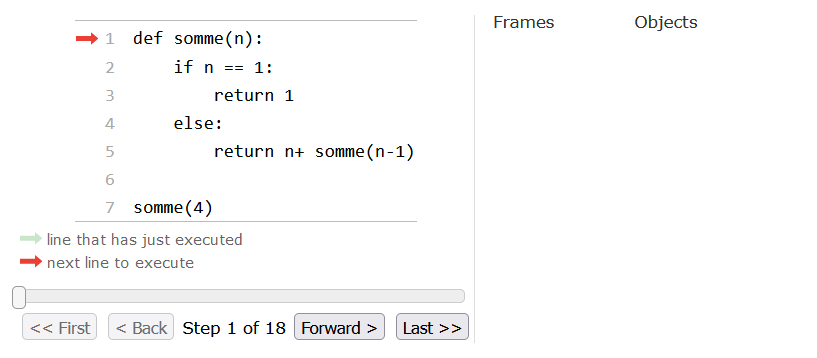
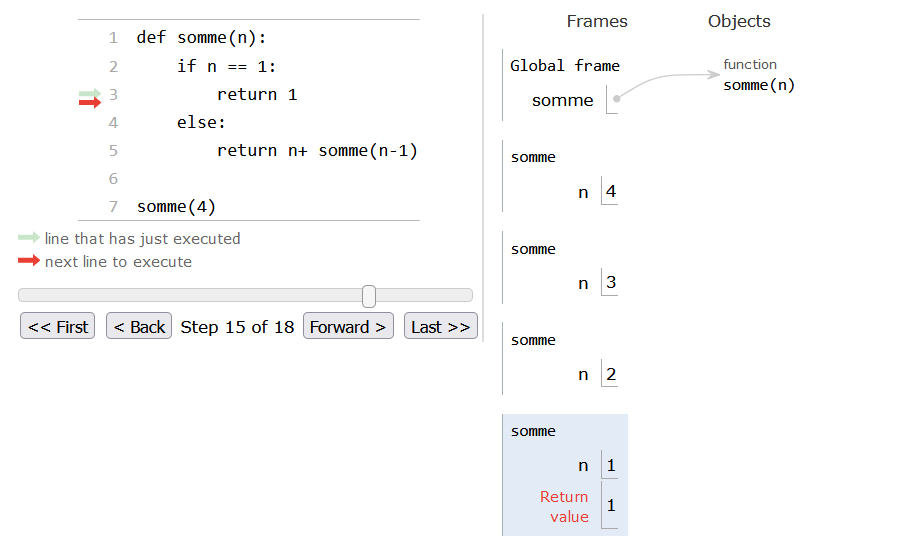
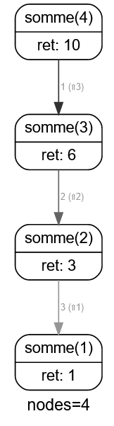

.. TNSI

Récursivité
===========

Programmation itérative
-----------------------

En informatique, le paradigme impératif avec les **boucles**, permet de répéter autant de fois que nécessaire une même
instruction ou un même bloc d'instructions.

Le calcul d'une somme de nombre entiers consécutifs se réalise facilement avec un code itératif.

.. rubric:: avec une boucle bornée for.

.. literalinclude:: ../python/activite.py
   :lines: 1,12-15

.. rubric:: avec une boucle conditionnelle while.

.. literalinclude:: ../python/activite.py
   :lines: 17,29-34
   
Fonction récursive
------------------

La récursivité est un phénomène qui se répète, qui s'applique à lui-même.

.. image:: ../img/vache.jpg
   :alt: La récursivité c'est vache
   :align: center
   :width: 480
   :class: b-8
   
Une fonction **récursive** est une fonction qui s'appelle elle-même.
Bien évidemment, elle ne peut s'appeler elle-même indéfiniment ! Elle contient donc une **condition d'arrêt**.

.. rubric:: Remarques

- Une fonction récursive est appelée une première fois avec ses arguments. Cette fonction, en s'exécutant, va donc
  s'appeler elle-même avec d'autres arguments, qui va donc s'appeler elle-même encore une troisième fois avec d'autres arguments, et ainsi de suite ...
- Une condition d'arrêt sur la valeur des arguments est vérifiée à chaque appel. Lorsque la condition est vraie, les appels
  s'arrêtent. Une pile d'appels s'est consituée mettant en attente toutes les fonctions appelantes.
- La pile des fonctions en attente reprend son éxécution jusqu'à l'appel initial qui renvoie le résultat attendu.

.. admonition:: Exemple

   La fonction ``somme(n)`` calcule la somme des :math:`n` premiers entiers.

   Pour calculer :math:`S=1+2+3+4`, on appelle la fonction ``somme(4)``.

   - Calculer la somme des 4 premiers entiers revient à ajouter au nombre 4 la somme des 3 premiers entiers: :code:`4+somme(3)`
   - Calculer la somme des 3 premiers entiers revient à ajouter au nombre 3 la somme des 2 premiers entiers: :code:`3+somme(2)`
   - Calculer la somme des 2 premiers entiers revient à ajouter au nombre 2 la somme du premier entier: :code:`2+somme(1)`
   - Calculer la somme du premier entier revient à renvoyer sa valeur c'est à dire :code:`somme(1)=1`.

   Donc nous avons les appels successifs:

   - :code:`somme(4) = 4 + somme(3)` se met en attente du résultat de l'appel de somme(3)
   - :code:`somme(3) = 3 + somme(2)` se met en attente du résultat de l'appel de somme(2)
   - :code:`somme(2) = 2 + somme(1)` se met en attente du résultat de l'appel de somme(1)
   - :code:`somme(1) = 1`
   - :code:`somme(2) = 2 + 1 = 3` reprise de l'appel de la fonction avec la valeur renvoyée 1
   - :code:`somme(3) = 3 + 3 = 6` reprise de l'appel de la fonction avec la valeur renvoyée 3
   - :code:`somme(4) = 4 + 6 = 10` reprise de l'appel de la fonction avec la valeur renvoyée 6

Le code de la fonction récursive ``somme`` est donc:

.. code-block:: python

   def somme(n):
       if n == 1:
           return 1
       else:
           return n + somme(n-1)

Visualiser la récursivité
-------------------------

Il est difficile d'imaginer la pile des appels et la remontée de cette pile avec les valeurs renvoyées.

On peut visualiser ces appels récursifs en utilisant 2 modules : **Python tutor** et **rcviz**.

.. rubric:: Avec python tutor

.. code-block:: python

   from tutor import tutor

   def somme(n):
       if n == 1:
           return 1
       else:
           return n + somme(n-1)
       
   somme(4)
   tutor()

   Initialisation de Python tutor

   Exécution jusqu'au cas de base

.. rubric:: Avec rcviz

.. code-block:: python

   from rcviz import viz

   @viz # décorateur python 
   def somme(n):
       if n == 1:
           return 1
       else:
           return n + somme(n-1)
 
   somme(4) # exécution de la fonction
   somme.callgraph() # affichage des appels récursifs pour la fonction exécutée

   
   La pile des appels récursifs
