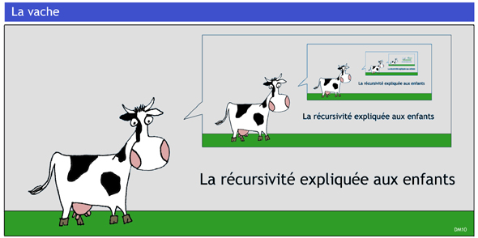

.. TNSI

Récursivité
===========
   
Fonction récursive
------------------

La récursivité est un phénomène qui se répète, qui s'applique à lui-même.

   
Une fonction **récursive** est une fonction qui s'appelle elle-même.
Bien évidemment, elle ne peut s'appeler elle-même indéfiniment ! Elle contient donc une **condition d'arrêt**.

.. rubric:: Remarques

- Une fonction récursive est appelée une première fois avec ses arguments. Cette fonction, en s'exécutant, va donc s'appeler elle-même avec d'autres arguments, qui va donc s'appeler elle-même encore une troisième fois avec d'autres arguments, et ainsi de suite ...
- Une condition d'arrêt sur la valeur des arguments est vérifiée à chaque appel. Lorsque la condition est vraie, les appels s'arrêtent. Une pile d'appels s'est consituée mettant en attente toutes les fonctions appelantes.
- La pile des fonctions en attente reprend son éxécution jusqu'à l'appel initial qui renvoie le résultat attendu.

.. admonition:: Exemple

   Le jeu des tours de Hanoï a une solution récursive. Pour 4 disques:
   
   -  on résout le problème avec 3 disques en les déplaçant du poteau de départ ``D`` au poteau intermédiaire ``I``;
   -  le plus grand disque est libre; on le déplace sur le poteau d'arrivée ``A``;
   -  on résout le problème avec 3 disques en les déplaçant du poteau intermédiaire ``I`` au poteau d'arrivée ``A``.

   .. figure:: ../img/tour_hanoi_4_solution.svg
      :align: center
      :width: 480

   La résolution à 3 disques fait appel à la solution à 2 disques qui elle-même fait appel à la solution à 1 disque qui consiste à déplacer ce plus petit disque. Ce dernier appel constitue le cas de base. 
   
.. code-block:: python

   def tour_hanoi(n,D,I,A):
       if n > 0:
           # on applelle la résolution pour n-1 disques
           tour_hanoi(n-1,D,I,A)
           # on déplace le disque libéré de D vers A
           deplacer(D,A)
           # on appelle la résolution des n-1 disques en I vers A
           tour_hanoi(n-1,I,D,A)

Le code Python précédent peut être écrit autrement, avec une condition d'arrêt pour ``n=1`` disque:

.. code-block:: python

   def tour_hanoi(n,D,I,A):
       if n == 1:
           # on déplace le disque de D vers A
           deplacer(D,A)
       else:
           # on applelle la résolution pour n-1 disques
           tour_hanoi(n-1,D,I,A)
           # on déplace le disque libéré de D vers A
           deplacer(D,A)
           # on appelle la résolution des n-1 disques en I vers A
           tour_hanoi(n-1,I,D,A)

Pile d'appels de la récursivité
-------------------------------

Une fonction récursive crée une pile d'appels et interrompt l'exécution du code à chaque appel. Lorsque le dernier appel renvoie une réponse, la pile d'appels se vide et le code reprend là où il s'est interrompu.

On peut visualiser ces appels récursifs en utilisant 2 modules : **Python tutor** et **rcviz**.

